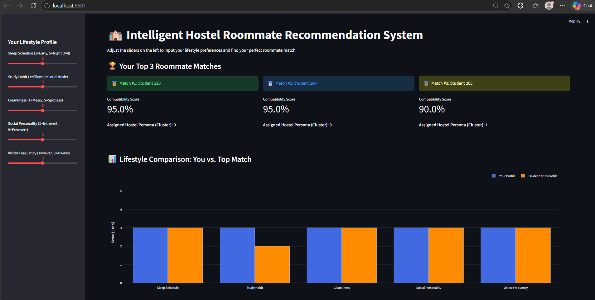
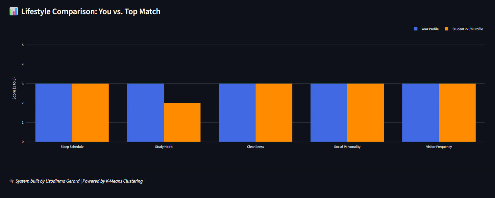
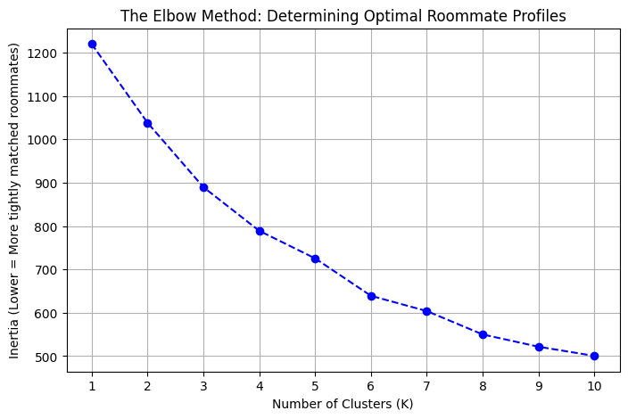

# 🏫 Intelligent Hostel Roommate Recommendation System

An unsupervised machine learning system designed to solve university hostel allocation conflicts by grouping students based on behavioral compatibility.

## 🎯 The Problem

Random hostel allocation often results in roommate conflicts, sleep disruption, and poor academic performance. This project replaces random allocation with a data-driven approach, ensuring students are matched with highly compatible peers.

## 🧠 The Machine Learning Architecture

1. **Data Constraints:** Hard filtering applied to immutable traits (Gender, Smoker Status).
2. **K-Means Clustering:** Students are clustered into specific behavioral "Personas" (e.g., The Quiet Scholars, The Social Night Owls) using a standardized 1-5 scale.
3. **Compatibility Engine:** A custom mathematical function calculates a precise 0-100% compatibility score based on weighted penalties (e.g., differences in sleep schedules are penalized heavier than differences in social personality).

## 📸 System Previews

### 1. User Input & Top Matches

### 2. Visual Compatibility Analysis

### 3. Algorithm Validation (The Elbow Method)

## 🛠️ Tech Stack

- **Language:** Python 3
- **Machine Learning:** Scikit-Learn (K-Means, StandardScaler)
- **Data Manipulation:** Pandas, NumPy
- **Frontend UI:** Streamlit
- **Data Visualization:** Matplotlib, Plotly

## 🚀 How to Run Locally

1. Clone the repository.
2. Install the requirements: `pip install pandas numpy scikit-learn matplotlib plotly streamlit`
3. Generate the dataset: `python generate_data.py`
4. Run the application: `streamlit run app/main.py`

---

_Developed by Uzodinma Gerard for academic defense._
